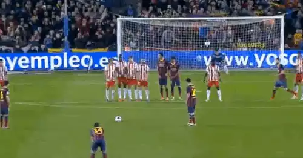

# Few Words About Me


## I am {a | an}:

<center><div class = "fragment roll-in"></div></center>
<ul>
<li class="fragment roll-in"><strong><font color = 'red'>Self Taught Coder and Data Scientist (circa 2010)</font></strong></li>
<li class="fragment roll-in"><strong><font color = 'red'>Data Visualization Fanatic</font></strong></li>
<li class="fragment roll-in"><strong><font color = 'red'>Impassioned Data Explorer</font></strong></li>
<li class="fragment roll-in"><strong><font color = 'red'>Angel Investor</font></strong></li>
<li class="fragment roll-in"><strong><font color = 'red'>Sports Fan</font></strong></li>
<ul>

# Enough About Me

## Let Talk About Angus

## <small>Angus <span class="fragment roll-in"><font color = "red">MacGyver</font></span></small>

<iframe class = 'fragment roll-in' width="640" height="500" src="https://www.youtube.com/embed/UKTNWI0eYJ4" frameborder="0" allowfullscreen></iframe>

## MacGyver

<blockquote class = 'fragment roll-in'>
<p><strong><i>adj.</i></strong><br>One who performs<strong><font color = "blue"> great feats of ingenuity</font> on a <font color = "red">moments notice</font>.</strong></p>
</blockquote>

## Someone Who..

<ul>
<li class="fragment roll-in">Possesses <strong><font color = 'blue'>Superior Analytical Skills</font></strong></li>
<li class="fragment roll-in">Is Able to <strong><font color = 'blue'>Decompose</font></strong> and <strong><font color = 'blue'>Solve Complex Problems</font></strong></li>
<li class="fragment roll-in">Is <strong><font color = 'blue'>Extremely Resourceful</font></strong></li>
<li class="fragment roll-in">Understands <strong><font color = 'blue'>What People Want</font></strong></li>
<li class="fragment roll-in">Can <strong><font color = 'blue'>See What Others May Not</font></strong></li>
<li class="fragment roll-in"><strong><font color = 'blue'><p class = "fragment grow">Can Turn What We Have (or know how to find) </font><font color = 'red'>Into What We Need</font></p></strong></li>
</ul>

## <small>Our SAK {Swiss Army Knife}</small>


## Alex's Mac Hacking Recipe

<ul>
<li class="fragment roll-in"><strong><font color = 'red'>Find the data</font></strong></li>
<li class="fragment roll-in"><strong><font color = 'red'>Clean the data</font></strong></li>
<li class="fragment roll-in"><strong><font color = 'red'>Resolve the data</font></strong></li>
<li class="fragment roll-in"><strong><font color = 'red'>Visualize the data</font></strong></li>
</ul>

##<small>An Example <i>Mac Hack</i></small>
<div class = "fragment roll-in">
Who was MacGyver?

</div>

##<small>With a Little Imagination and Our SAK, A Word Cloud</small>

```{r, echo=FALSE,autodep=FALSE,warning=FALSE,tidy=FALSE,cache.comments=FALSE,cache=FALSE,results='hide',include=FALSE}
macgyver_me <- function(){
	packages <- 
	c('magrittr', 'dplyr', 'rvest', 'qdap', 'tidyr', 'stringr', 'stringi', 'tm', 'readr', 'wordcloud')

lapply(packages, library, character.only = T)

	mac.stuff <- 
	read_csv('data/mac/mac.csv')
mystopwords <- 
	c(stopwords('english'),"used","with", 'made')

tdm <- 
	mac.stuff %>% 
	DataframeSource %>% 
	Corpus %>% 
	tm_map(function(x)removeWords(x,mystopwords)) %>% 
	TermDocumentMatrix


m <- 
	tdm %>% 
	as.matrix()
v <- 
	m %>% 
	rowSums %>% 
	sort(decreasing=TRUE)

d <- 
	data.frame(word = names(v),freq=v)

wordcloud(d$word,d$freq, scale=c(4,.2), max.words=300, random.order=FALSE, rot.per=0.15, use.r.layout=TRUE, colors=wesanderson::wes_palette('Zissou'))
}
```

```{r, echo=TRUE,message=FALSE, warning=FALSE, fig.width = 8, fig.height = 4.5}
macgyver_me()
```

## Classic MacGyver Escape

<iframe  class = 'fragment roll-in'width="640" height="390" src="https://www.youtube.com/embed/LTWEh2mcdsg" frameborder="0" allowfullscreen></iframe>

# <small><strong><font color = "red">Sports</font></strong> <span class = "fragment roll-in">The World's Glue</span></small>

## <small>But Why</small>
<ul>
<li class="fragment roll-in"><strong><font color = 'red'>Uniter of People</font></strong></li>
<li class="fragment roll-in"><strong><font color = 'red'>Giver of Identity</font></strong></li>
<li class="fragment roll-in"><strong><font color = 'red'>Creator of Role Models</font></strong></li>
<li class="fragment roll-in"><strong><font color = 'red'>An Experience That Provides Real Drama Without Real Consequences</font></strong></li>

</ul>


## <small>Sports and Modern Society</small>
<li class="fragment roll-in"><strong><font color = 'red'>Experience Enhanced by Technology</font></strong></li>
<li class="fragment roll-in"><strong><font color = 'red'>Mainstream Media's Biggest Magnet</font></strong></li>
<li class="fragment roll-in"><strong><font color = 'red'>Center of Social Media Conversation</font></strong></li>

</ul>


## <small>Where Else Does This Happen??</small>
<div class = "fragment roll-in">

</div>

## <small>Or This..</small>
<div class = "fragment roll-in">

</div>

##<small>Where Else Do Mom's Get This Into A Rivalry??</small>
<div class = "fragment roll-in">

</div>


##<small>Or It's Acceptible for Two Grown Men to Get Down Like This?</small>
<div class = "fragment roll-in">

</div>

##<small>Where Else Does Superstition Take On a Life Of It's Own?</small>
<div class = "fragment roll-in">

</div>


##<small>Or Can a Magician Perform Real Magic</small>
<div class = "fragment roll-in">

</div>

##<small>Because Sports Are the Only Place Where David Can Beat Goliath in Front of the Entire World</small>

<div class = "fragment roll-in">

</div>

#<small>Now, Let's Look at Some <stron><font color = "red">Sports</font></strong> Mac Hacks</small>

##<small>To Potentially Unite the State of .....</small>
<iframe  class = 'fragment roll-in' width="700" height="600" src="statebins/index.html" frameborder="0" allowfullscreen></iframe>


##<small>Explore the Growth of NFL Lineman</small>

```{r, echo=FALSE,autodep=FALSE,warning=FALSE,tidy=FALSE,cache.comments=FALSE,cache=FALSE,results='hide',include=FALSE}
tufte_lineman <- 
	function(){
	packages <- 
	c('dplyr', 'tidyr', 'ggplot2', 'readr', 'magrittr')
lapply(packages, library, character.only = T)

data.means <-
	read_csv('data/nfl/mean_lineman.csv')

biggest <-
	read_csv('data/nfl/biggest.csv')

smallest <-
	read_csv('data/nfl/smallest.csv')

all_players <-
	read_csv('data/nfl/all_lineman.csv')

p2 <- 
	data.means %>% 
	ggplot(aes(year.draft, mean)) +
	theme(plot.background = element_blank(),
				panel.grid.minor = element_blank(),
				panel.grid.major = element_blank(),
				panel.border = element_blank(),
				panel.background = element_blank(),
				axis.ticks = element_blank(),
				#axis.text = element_blank(),
			axis.title = element_blank()) +
geom_linerange(data.means, mapping=aes(x=year.draft, ymin=min, ymax=max), colour = "wheat2", alpha=1)

p2 <- 
	p2 +
	geom_linerange(data.means, mapping=aes(x=year.draft, ymin=lower.mean, ymax=upper.mean), colour = "firebrick",alpha = 1)

p2 <- 
	p2 +
	geom_line(data.means, mapping=aes(x=year.draft, y=mean, group=1)) +
	geom_vline(xintercept = 1935, colour = "black", linetype=1, size=1, alpha = .5)

p2 <- 
	p2 +
	coord_cartesian(ylim = c(170,390)) +
	scale_y_continuous(breaks = seq(170, 390, by=10)) +
	scale_x_continuous(breaks = seq(1935, 2015, 5))

p2 <- 
	p2 + 
	geom_hline(yintercept = 180, colour = "white", linetype=1) +
	geom_hline(yintercept = 200, colour = "white", linetype=1) +
	geom_hline(yintercept = 220, colour = "white", linetype=1) +
	geom_hline(yintercept = 240, colour = "white", linetype=1) +
	geom_hline(yintercept = 260, colour = "white", linetype=1) +
	geom_hline(yintercept = 280, colour = "white", linetype=1) +
	geom_hline(yintercept = 300, colour = "white", linetype=1) +
	geom_hline(yintercept = 320, colour = "white", linetype=1) +
	geom_hline(yintercept = 340, colour = "white", linetype=1) +
	geom_hline(yintercept = 360, colour = "white", linetype=1) +
	geom_hline(yintercept = 380, colour = "white", linetype=1) 

p2 <- 
	p2 +
	geom_point(data=all_players, aes(x=year.draft, y=weight.lbs), colour="blue3",
						 alpha = .1, position = position_jitter(w = 0.35, h = 0.5))

p2 <- 
	p2 +
	geom_point(data = smallest, aes(x=year.draft, y=weight.lbs), colour="blue3") +
	geom_point(data = biggest, aes(x=year.draft, y=weight.lbs), colour="firebrick3")

#Next, we can add the data that represents the 95% confidence interval around the daily mean temperatures for 1975-2013.

p2 <- 
	p2 +
	annotate("segment", x = 1954, xend = 1950, y = 310, yend = 320, colour = "firebrick3") +
	annotate("text", x = 1950, y = 324, label = "Earl Putman", size=3, colour="firebrick3") +
	annotate("segment", x = 1999, xend = 1995, y = 375, yend = 380, colour = "firebrick3") +
	annotate("text", x = 1994, y = 383, label = "Aaron Gibson", size=3, colour="firebrick3") +
	annotate("segment", x = 1982, xend = 1985, y = 190, yend = 183, colour = "blue3") +
	annotate("text", x = 1985, y =180, label = "Brian Clark", size=3, colour="blue3") +
	annotate("segment", x = 1992, xend = 1995, y = 255, yend = 245, colour = "blue3") +
	annotate("text", x = 1995, y =240, label = "Kendall Gammon", size=3, colour="blue3")
	

p2 <- 
	p2 +
	ggtitle("MacGyvering NFL Draft Data") +
	theme(plot.title=element_text(face="bold",hjust=.15, vjust=-2.0, colour="red",size=24)) +
	annotate("text", x = 1960, y = 368, label = "Evolution of Offensive Lineman Weight - 1936-2015", size=4, fontface="bold")

p2 <- 
	p2 +
	annotate("text", x = 1960, y = 360,
					 label = "Data represents reported weight in pounds of drafted NFL Offensive Lineman", size=3, colour="gray30") +
	annotate("text", x = 1960, y = 352,
					 label = "as reported by Football-Reference.com", size=3, colour="gray30") 
return(p2)
}
```

```{r, echo=TRUE,message=FALSE, warning=FALSE, fig.width = 8, fig.height = 4.50}
tufte_lineman()
```

##<small>Answer for Good What was the Color of <font color = "gold">The</font><font color = "blue"> Dress...</font></small>
```{r, echo=FALSE,autodep=FALSE,warning=FALSE,tidy=FALSE,cache.comments=FALSE,cache=FALSE,results='hide',include=FALSE}
what_color_really <- function(){
	library(rPlotter)
library(dplyr)
extract_colours <- function(
	url_img = "http://developer.r-project.org/Logo/Rlogo-1.png", num_col = 5, rsize = 100) {
	
	## Read Image
	if (class(url_img) != "Image") {
		img <- readImage(url_img) # local file or url
	} else {
		img <- url_img # is already a loaded "Image"
	}
	
	## Resize Image (make it smaller so the remaining tasks run faster)  
	if (max(dim(img)[1:2]) > rsize) {
		if (dim(img)[1] > dim(img)[2]) {
			img <- resize(img, w = rsize)
		} else {
			img <- resize(img, h = rsize)
		}
	}
	
	## Melt
	img_melt <- melt(img)
	
	## Reshape
	img_rgb <- reshape(img_melt, timevar = "Var3", idvar = c("Var1", "Var2"), direction = "wide")
	img_rgb$Var1 <- -img_rgb$Var1
	
	## Detect dominant colours with kmeans (multiple starts)
	col_dom <- kmeans(img_rgb[, 3:5], centers = num_col, nstart = 3, iter.max = 100)
	
	## Return k-means centers as RGB colours
	cus_pal <- sort(rgb(col_dom$centers))
	return(as.character(cus_pal))
	
}

url.image <- 
	"http://www.wired.com/wp-content/uploads/2015/02/Untitled-12.jpg"

bigpal <-
	url.image %>% 
	extract_colours( 256, 200)
## get 5 best 6 colour palettes for MPD
newpal <- 
	bigpal %>% 
	mpd_select_colours(sat.thresh = 0.25, dark.thresh = 0.1 , ncolours = 6, nreturn = 5)
## plot palettes
image <- 
	readImage(url.image)
h <- 
	split.screen(c(1,2))
par(mar = c(0,0,0,0)) # set zero margins on all 4 sides
plot(x = NULL, y = NULL, xlim = c(0,400), ylim = c(0,400), pch = '',
		 xaxt = 'n', yaxt = 'n', xlab = '', ylab = '', xaxs = 'i', yaxs = 'i',
		 bty = 'n', asp=1) # plot empty figure
rasterImage(image, xleft = 0, ybottom = 0, xright = 400, ytop = 400) # plot jpeg
screen(2)
par(mar=c(0,0,0,0))
h <- split.screen(c(5,1))
for (i in 1:length(newpal)) {
	screen(2+i)
	pie(rep(1, 4), col = newpal[[i]])
}
}
```

```{r, echo=TRUE,message=FALSE, warning=FALSE, fig.width = 8, fig.height = 4.50}
what_color_really()
```

##<small>Explore Where A Double Is Likely to Fall</small>
```{r, echo=FALSE,autodep=FALSE,warning=FALSE,tidy=FALSE,cache.comments=FALSE,cache=FALSE,results='hide',include=FALSE}
doubles_2014 <- 
	function(){
		packages <-
			c('dplyr','readr','rbokeh')
		lapply(packages, library, character.only = T)
		doubles <-
			read_csv('data/mlb/2014_doubles.csv')
		base_x <-
			c(90 * cos(pi / 4), 0, 90 * cos(3 * pi / 4), 0)
		base_y <-
			c(90 * cos(pi / 4), sqrt(90 ^ 2 + 90 ^ 2), 90 * sin(pi / 4), 0)
		distarc_x <-
			lapply(c(2:4) * 100, function(a)
				seq(a * cos(3 * pi / 4), a * cos(pi / 4), length = 200))
		distarc_y <-
			lapply(distarc_x, function(x)
				sqrt((x[1] / cos(3 * pi / 4)) ^ 2 - x ^ 2))
		
		figure(
			title = "All 2014 MLB Doubles", xgrid = FALSE, ygrid = FALSE, width = 525, height = 525,
			xlab = "Horizontal distance from home plate (ft.)",
			ylab = "Vertical distance from home plate (ft.)"
		) %>%
			## boundary
			ly_segments(c(0, 0), c(0, 0), c(-300, 300), c(300, 300), alpha = 0.4) %>%
			## bases
			ly_crect(
				base_x, base_y, width = 10, height = 10,
				angle = 45 * pi / 180, color = "black", alpha = 0.4
			) %>%
			## infield/outfield boundary
			ly_curve(
				60.5 + sqrt(95 ^ 2 - x ^ 2),
				from = base_x[3] - 26, to = base_x[1] + 26, alpha = 0.4
			) %>%
			## distance arcs (ly_arc should work here and would be much simpler but doesn't)
			ly_multi_line(distarc_x, distarc_y, alpha = 0.4) %>%
			## hit hexbin
			ly_hexbin(
				doubles, xbins = 50, shape = 0.77, alpha = 0.75, palette = "Spectral10"
			)
	}
```

```{r, echo=FALSE, message=FALSE, warning=FALSE}
doubles_2014()
```

##<small>Examine the Rise of A Titan</small>
```{r, echo=FALSE,autodep=FALSE,warning=FALSE,tidy=FALSE,cache.comments=FALSE,cache=FALSE,results='hide',include=FALSE}
some_curry <- function(){
	packages <-
			c('dplyr','readr','rbokeh')
		lapply(packages, library, character.only = T)
steph <- 
	read_csv('data/nba/steph.csv')
figure(xlab = "season", title = "The Evolution of Stephen Curry", ylab = "Points", xgrid = FALSE, ygrid = FALSE, width = 525, height = 525) %>%
	ly_boxplot(season %>% as.character, pts, data =steph, alpha = 1,fill_color = '#FFCC33', 
						 line_color = '#04529C')
	}
```

```{r, echo=FALSE,message=FALSE, warning=FALSE, fig.width = 8, fig.height = 4.50}
some_curry()
```

##<small>Color Me Wise About Swimsuit Colors</small>
```{r, echo=FALSE,autodep=FALSE,warning=FALSE,tidy=FALSE,cache.comments=FALSE,cache=FALSE,results='hide',include=FALSE}
swimsuit_colors <- function(){
packages <-
	c('readr', 'dplyr', 'magrittr', 'ggplot2', 'wesanderson', 'ggthemes')
lapply(packages, library, character.only = T)
covers <- 
	'data/si/swimsuit_covers_raw.csv' %>% 
	read_csv

years <- 
	covers$Year

colors <- 
	covers$Color
all_colors <-
	data_frame()
for(c in 1:length(colors)){
	color <- 
		colors[c]
	color %<>% 
		str_split('\\,') %>% 
		unlist
	
	data <- 
		data_frame(year = years[c], color)
	
	data %<>% 
		mutate(decade = data$year %>% substr(1,3) %>% paste0('0s'))
	all_colors %<>%
		bind_rows(data)
}

covers_tally <- 
	all_colors %>% 
	group_by(decade, color) %>% 
	tally(sort = T)
	
pal <-
	c(wes_palette("Darjeeling"),wes_palette("Darjeeling2"))
plot <-
	all_colors %>% 
	ggplot(aes(x=color,y=..count.., fill = decade)) +
	geom_histogram(alpha = .75 ) +
	scale_fill_manual(values = pal) +
	facet_grid(.~ decade, scales = "fixed") +
	ylab(" ") +
	xlab(" ") +
	theme_few(base_family = "Helvetica",base_size = 8) +
	#scale_y_continuous(breaks=seq(0,.12,.01), labels=percent) +
	theme(legend.position="none") +
	coord_flip() +
	scale_y_reverse() +
	labs(title="Sports Illustrated Swimsuit Edition Covers\nBathing Suit Colors by Decade")
plot
}
```

```{r, echo=TRUE,message=FALSE, warning=FALSE, fig.width = 8, fig.height = 4.50}
swimsuit_colors()
```

#In Conclusion

##<small>In the Words of Angus Mac</small>
<blockquote class = 'fragment roll-in'>
<p><strong><i><font color = "blue">Any problem can be solved with a little ingenuity.</font></i></strong></p>
</blockquote>

## So Get Ready Because..
<blockquote class = 'fragment roll-in'>
<p><strong><i><font color = "red">Another day, a whole 'nother set of possibilities.</font></i></strong></p>
</blockquote>

<span class = 'fragment roll-in'>
Get Your SAK's Ready Because It's Time to Mac Hack and...
<span class="fragment roll-in">We Are <strong><font color = 'red'>Angus</font></strong></span>
</span>

## Thank You 
<div class="fragment roll-in">
<p>Feel Free to <a href = "https://github.com/abresler/si_hackathon">Fork</a> This Presentation and Code on Github</p>
</div>
<div class="fragment roll-in">
<p>Don't hesitate to reach out to me on twitter at <a href = "https://twitter.com/abresler" target ="_blank">abresler</a></p>

</div>
