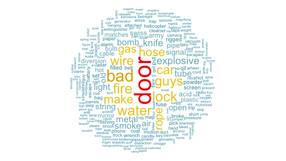
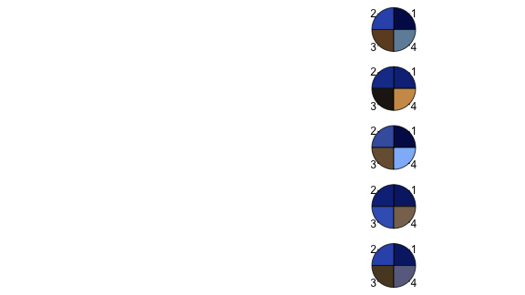

# Few Words About Me


## I am {a | an}:

<center><div class = "fragment roll-in"></div></center>
<ul>
<li class="fragment roll-in"><strong><font color = 'red'>Self Taught Coder and Data Scientist (circa 2010)</font></strong></li>
<li class="fragment roll-in"><strong><font color = 'red'>Data Visualization Fanatic</font></strong></li>
<li class="fragment roll-in"><strong><font color = 'red'>Impassioned Data Explorer</font></strong></li>
<li class="fragment roll-in"><strong><font color = 'red'>Angel Investor</font></strong></li>
<li class="fragment roll-in"><strong><font color = 'red'>Sports Fan</font></strong></li>
<ul>

# Enough About Me

## Angus MacGyver

<iframe class = 'fragment roll-in' width="640" height="500" src="https://www.youtube.com/embed/UKTNWI0eYJ4" frameborder="0" allowfullscreen></iframe>

## MacGyver

<blockquote class = 'fragment roll-in'>
<p><strong><i>adj.</i></strong><br>One who performs<strong><font color = "blue"> great feats of ingenuity</font> on a <font color = "red">moments notice</font>.</strong></p>
</blockquote>

## Someone Who..

<ul>
<li class="fragment roll-in">Possesses <strong><font color = 'blue'>Superior Analytical Skills</font></strong></li>
<li class="fragment roll-in">Is Able to <strong><font color = 'blue'>Decompose</font></strong> and <strong><font color = 'blue'>Solve Complex Problems</font></strong></li>
<li class="fragment roll-in">Is <strong><font color = 'blue'>Extremely Resourceful</font></strong></li>
<li class="fragment roll-in">Understands <strong><font color = 'blue'>What People Want</font></strong></li>
<li class="fragment roll-in">Can <strong><font color = 'blue'>See What Others May Not</font></strong></li>
<li class="fragment roll-in"><strong><font color = 'blue'><p class = "fragment grow">Can Turn What We Have </font><font color = 'red'>Into What We Need</font></p></strong></li>
</ul>

## <small>Our SAK {Swiss Army Knife}</small>


## Mac Hacking

<ul>
<li class="fragment roll-in"><strong><font color = 'red'>Find the data</font></strong></li>
<li class="fragment roll-in"><strong><font color = 'red'>Clean the data</font></strong></li>
<li class="fragment roll-in"><strong><font color = 'red'>Resolve the data</font></strong></li>
<li class="fragment roll-in"><strong><font color = 'red'>Visualize the data</font></strong></li>
</ul>

##<small>A Mac Hack Example</small>
<div class = "fragment roll-in">
Who was this McGyver guy?
</div>

## Boom


```r
macgyver_me()
```

 

## Great Escape

<iframe  class = 'fragment roll-in'width="640" height="390" src="https://www.youtube.com/embed/LTWEh2mcdsg" frameborder="0" allowfullscreen></iframe>

# <small>Professional Sports, The World's Glue</small>

## <small>But Why</small>
<ul>
<li class="fragment roll-in"><strong><font color = 'red'>Brings People Together</font></strong></li>
<li class="fragment roll-in"><strong><font color = 'red'>Experience Enhanced by Technology</font></strong></li>
<li class="fragment roll-in"><strong><font color = 'red'>Draws the Largest Television Audience</font></strong></li>
<li class="fragment roll-in"><strong><font color = 'red'>The Largest Proportion of Daily Google and Twitter Trends</font></strong></li>
<li class="fragment roll-in"><strong><font color = 'blue'><p class = "fragment grow">To Name Just a Few!!</p></font></strong></li>
</ul>


## <small>Where Else Does This Happen??</small>
<div class = "fragment roll-in">

</div>

## <small>Or This..</small>
<div class = "fragment roll-in">

</div>

##<small>Where Mom's Get This Into Rivalry</small>
<div class = "fragment roll-in">

</div>


##<small>Where Two Grown Men Can Truly Let Loose and Get Down</small>
<div class = "fragment roll-in">

</div>

##<small>Where Superstition Takes On a Life Of It's Own</small>
<div class = "fragment roll-in">

</div>


##<small>Where Magicians Perform Real Magic</small>
<div class = "fragment roll-in">

</div>

##<small>Where David Can Beat Goliath</small>

<div class = "fragment roll-in">

</div>

#<small>Let's Look at Some Sports Mac Hacks</small>

##<small>To Unite the State of .....</small>
<iframe  class = 'fragment roll-in' width="700" height="600" src="statebins/index.html" frameborder="0" allowfullscreen></iframe>


##<small>NFL O-Line Evolution</small>


```r
tufte_lineman()
```

```
## Error in annotate("segment", x = 1954, xend = 1950, y = 310, yend = 320, : unused arguments (x = 1954, xend = 1950, y = 310, yend = 320, colour = "firebrick3")
```

##<small><font color = "gold">The</font><font color = "blue"> Dress...</font></small>


```r
what_color_really()
```

 
